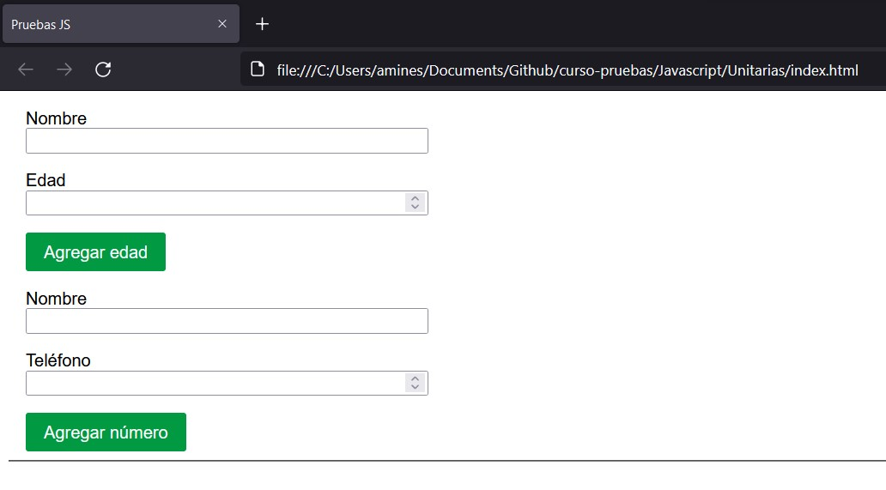

# Pruebas en Javascript

En esta carpeta puedes encontrar un escenario de introducción a las pruebas de Javascript, para no expandir el número de carpetas estoy trabajando con ramas.

|Nombre de rama|Intención|
|--------------|---------|
|inicio|Ejercicio base para trabajar|
|unitarias|Ejercicio de pruebas unitarias|

La rama **inicio** es con la que puedes comenzar para familiarizarte con el ejercicio. En este caso podrás ejecutar la aplicación de manera local.



Lo primero que debes hacer es instalar los paquetes de npm


```
npm install
```

Después de ello juega un poco con lo que el ejercicio puede hacer para poder agregar edades o números de teléfono de manera continua.